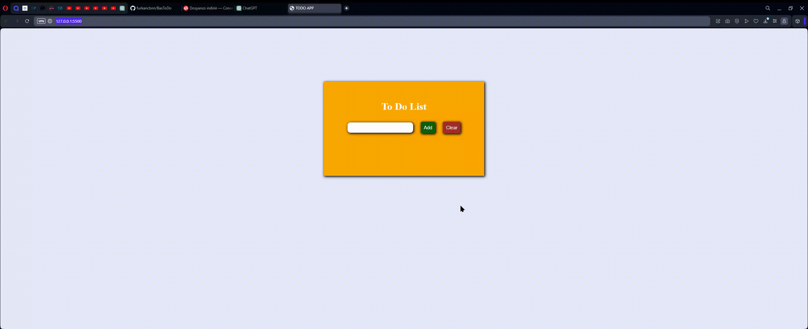

# TodoList

Detaylandırılmış JS açıklama:

1. **HTML Yapısını Oluştur:**

2. **JavaScript Dosyasını Bağla:**

3. **Değişken İsimlendirmesi:**
   - İlgili HTML elementlerine JavaScript'ten erişebilmek için değişkenlere uygun isimleri ver. Örneğin, "addToDo" butonu için bir değişken oluştur.

4. **Olayları Belirle:**
   - "Add" ve "Clear" butonlarına tıklama olaylarını (click events) belirle. Bu olaylar tetiklendiğinde çalışacak fonksiyonları belirle.

5. **JavaScript Fonksiyonunu Oluştur:**
   - Yukarıda belirlenen olaylarda çalışacak fonksiyonları oluştur.
   - "Add" butonuna tıklandığında çalışacak fonksiyon:
      - Yeni bir `p` (paragraf) elementi oluştur.
      - Oluşturulan `p` elementini `toDoContainer` içine ekle.
      - `inputText` içindeki değeri bu `p` elementinin içeriği olarak ayarla.
      - `inputText` içeriğini temizle.
      - Stil ekleyerek görünümü özelleştir.

6. **"Clear" Butonunu İşle:**
   - "Clear" butonuna tıklanınca çalışacak fonksiyon:
      - `toDoContainer` içindeki `p` elementini kaldır.
      - 
## Nasıl Kullanılır
1. `inputText` alanına yapılacak bir metin girin.
2. "Add Todo" düğmesine tıklayarak yapılacakları ekleyin.
3. Eklenen yapılacakları tıklayarak işaretleyin.
4. Eklenen yapılacakları çift tıklayarak silin.
5. "Clear Todo" düğmesine tıklayarak tüm yapılacakları temizleyin.

## Özellikler
- Yapılacaklar listesine eleman eklemek için "Add Todo" düğmesi.
- Eklenen yapılacakları işaretlemek için tıklama özelliği.
- Eklenen yapılacakları çift tıklayarak silme özelliği.
- Tüm yapılacakları temizlemek için "Clear Todo" düğmesi.

## Değişkenler
- `addToDoButton`: "Add" butonunu temsil eden HTML öğesi.
- `toDoContainer`: ToDo öğelerinin listelendiği konteyner div'i.
- `inputText`: Kullanıcının yeni görevleri eklemek için kullandığı metin kutusu.
- `clearToDoButton`: "Clear" butonunu temsil eden HTML öğesi.

## `addToDoButton` Olayı
Kullanıcı "Add" butonuna tıkladığında gerçekleşir.

## `clearToDoButton` Olayı
Kullanıcı "Clear" butonuna tıkladığında gerçekleşir.

